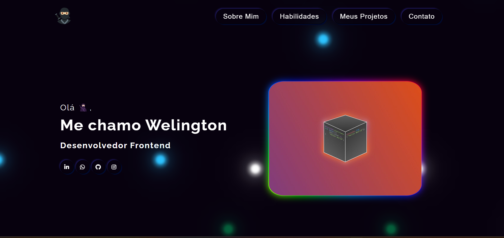

## Guia

- [Visão geral](#visão-geral)
  - [Funcionamento](#funcionamento)
  - [Aparência](#aparência)
  - [Links](#links)
- [Processo](#processo)
  - [Desenvolvido com](#desenvolvido-com)
  - [Aprendizado](#aprendizado)

## Visão geral

### Funcionamento

Objetivos:

- Listar minhas qualidades como desenvolvedor frontend
- Mostrar oque tenho a oferecer ao mercado de trabalho

### Aparência

### Links

- Live Site URL: (https://welington1209.github.io/portfolio/)

## Processo

### Desenvolvido com:

- Tag's semânticas de HTML
- Propriedades de estilização de CSS
- Flexbox
- Grid
- Responsividade
- Animações CSS

### Aprendizado

Neste projeto tive como desafio criar um portfolio com base no portfolio desenvolvido na aula de deep dives, usei o modelo proposto e dei alguns toques pessoais com algumas coisas que aprendi no curso!